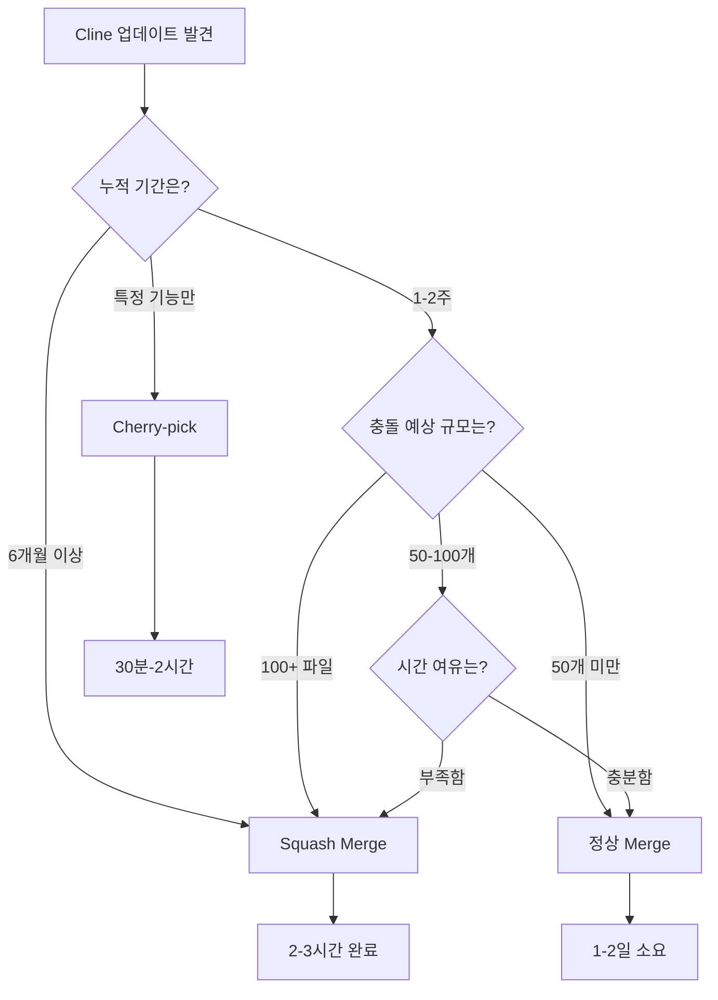

# Caret 머징 전략 종합 가이드

## 📋 **개요**

Caret은 Cline의 Fork 프로젝트로서, 지속적인 upstream 동기화가 필요합니다. 
이 문서는 다양한 머징 상황에 맞는 **최적의 전략**과 **작업 단위 분류**를 제공합니다.

### **🚨 2025-08-28 현재 상황**
- **026번 머징**: ✅ 완료 (Squash Merge 성공)
- **027번 진행 중**: Handler 아키텍처 도입을 위한 upstream 머징 필요
- **핵심 과제**: Agent/Chatbot 모드 대화 흐름 개선을 위한 최신 Cline 기능 통합

### **⭐ 핵심 원칙: Cline 원본 코드 수정 최소화**

> 모든 머징 및 기능 추가 작업 시 **Cline의 원본 코드를 직접 수정하는 것을 최소화**하는 것을 최우선 원칙으로 합니다. Caret 고유 기능은 `caret-src`와 같이 독립된 디렉토리에서 구현하여 충돌 가능성을 원천적으로 차단하고, 향후 Cline 업데이트 시 동기화 비용을 줄여야 합니다.

### **🎯 Caret 독립 시스템 참조**

**[Caret 독립적 Chatbot/Agent 시스템](../features/caret-independent-system.mdx)**이 본 가이드의 핵심 원칙을 완벽하게 구현한 모범 사례입니다:

- **✅ Level 1 독립 모듈**: 8-10개 핵심 파일만 수정으로 최소 변경 달성
- **✅ 어댑터 패턴**: ModeSystemRegistry를 통한 분기 로직 완전 중앙화
- **✅ 머징 안정성**: Plan/Act 코드와 0% 의존성으로 충돌 위험 최소화
- **✅ 확장성**: 새로운 모드 추가 시 어댑터만 구현하면 됨

이 독립 시스템은 **027-04 작업을 통해 검증된 아키텍처 패턴**으로, 향후 모든 Caret 기능 개발의 표준이 되어야 합니다.

## 🎯 **머징 전략 분류**

### **1. Squash Merge (일괄 통합)**

#### **적용 상황**
- ✅ **대규모 버전 갭**: 6개월 이상 누적된 변경사항
- ✅ **초기 설정**: 처음 Fork한 후 첫 번째 대규모 머징
- ✅ **긴급 기능 확보**: 특정 기능만 빠르게 가져와야 할 때
- ✅ **복잡성 회피**: 수백 개 파일 충돌이 예상되는 경우

#### **장점**
- 🚀 **빠른 완료**: 2-3시간 내 완료
- 🧹 **깔끔한 히스토리**: 하나의 의미있는 커밋
- ⚖️ **윤리적**: 원작자 크레딧 보존
- 🛡️ **충돌 최소화**: 개별 commit 충돌 없음

#### **단점**
- ❌ **개별 히스토리 손실**: commit별 상세 정보 사라짐
- ❌ **다음 머징 복잡화**: 추후 정상 merge 어려움
- ❌ **blame 정보 단순화**: 코드 작성자 추적 제한

#### **실행 예시**
```bash
git checkout -b feature/cline-squash-merge
git merge upstream/main --squash --strategy-option=theirs
git commit -m "Squash Merge: Cline v3.17.13 → v3.23.0"
git checkout main && git merge feature/cline-squash-merge --no-ff
```

### **2. 정상 Merge (표준 Git 머징)**

#### **적용 상황**
- ✅ **정기적 동기화**: 1-2주 간격의 정기 업데이트
- ✅ **히스토리 보존 중요**: 개별 commit 정보가 필요한 경우
- ✅ **점진적 통합**: 충돌 범위가 제한적일 때
- ✅ **협업 투명성**: 팀에서 변경사항 추적이 중요한 경우

#### **장점**
- ✅ **완전한 히스토리 보존**: 모든 commit과 작성자 정보 유지
- ✅ **정확한 blame**: 코드별 작성자 정확히 추적
- ✅ **지속적 호환성**: 다음 merge도 표준 방식으로 가능
- ✅ **Git 표준**: Git의 표준 워크플로우 준수

#### **단점**
- ⏱️ **시간 소요**: 충돌 해결에 1-2일 필요할 수 있음
- 🔥 **복잡한 충돌**: 수십-수백 개 파일에서 개별 충돌 발생
- 🧠 **높은 숙련도 요구**: Git merge 전문 지식 필요
- 📊 **복잡한 히스토리**: 브랜치 그래프가 복잡해짐

#### **실행 예시**
```bash
git checkout -b feature/cline-standard-merge
git merge upstream/main
# 충돌 해결 작업 (1-2일)
git checkout main && git merge feature/cline-standard-merge --no-ff
```

### **3. 선택적 Cherry-pick (부분 통합)**

#### **적용 상황**
- ✅ **특정 기능만**: 버그 수정이나 특정 기능만 필요할 때
- ✅ **실험적 도입**: 새 기능을 점진적으로 테스트하고 싶을 때  
- ✅ **호환성 우려**: 전체 merge는 위험하지만 일부는 안전할 때
- ✅ **우선순위 기반**: 중요한 변경사항부터 단계적 적용

#### **장점**
- 🎯 **정확한 제어**: 원하는 변경사항만 선택적 적용
- 🛡️ **위험 최소화**: 불필요한 변경으로 인한 부작용 방지
- ⚡ **빠른 적용**: 개별 commit은 빠르게 적용 가능
- 🧪 **테스트 용이**: 각 변경사항을 개별적으로 검증

#### **단점**
- 🧩 **의존성 문제**: 관련 commit을 놓칠 위험
- 📊 **관리 복잡성**: 어떤 commit을 적용했는지 추적 어려움
- ⏳ **누적 작업량**: 개별 적용이 쌓이면 오히려 비효율
- 🔗 **일관성 부족**: 부분적 적용으로 인한 기능 불완전

#### **실행 예시**
```bash
# GPT-5 관련 commit만 가져오기
git log upstream/main --oneline --grep="GPT-5" | head -3
git cherry-pick <commit-hash-1> <commit-hash-2> <commit-hash-3>
```

## 🔄 **머징 전략 결정 플로우차트**



## 📊 **작업 단위 분류 기준**

### **Level 1: 긴급 핵심 기능 (Priority Merge)**
- **대상**: 즉시 필요한 핵심 기능만
- **예시**: 새로운 AI 모델, 보안 수정, 성능 개선
- **전략**: Squash Merge 또는 Cherry-pick
- **소요시간**: 2-4시간
- **주기**: 필요시 즉시

### **Level 2: 정기 동기화 (Regular Sync)**
- **대상**: 1-2주 누적된 일반적 개선사항
- **예시**: UI 개선, 버그 수정, 새로운 Provider
- **전략**: 정상 Merge (가능하면) 또는 Squash Merge
- **소요시간**: 4-8시간 (충돌 정도에 따라)
- **주기**: 2주 간격

### **Level 3: 복잡한 통합 (Complex Integration) - 회피 권장**
- **대상**: 아키텍처 변경, 대규모 리팩토링
- **예시**: ~~Mode 시스템~~, WebView 구조 변경, Proto 체계 개편
- **전략**: 정상 Merge (계획적 접근) 또는 **독립 시스템으로 리팩터링**
- **소요시간**: 1-3일
- **주기**: 분기별 또는 필요시
- **⚠️ 주의**: **Level 3은 머징 충돌 위험이 높으므로, 가능하면 Level 1 독립 모듈로 설계 변경 권장**

### **🎯 Caret 독립 시스템 아키텍처 적용 사례**

**027-04 Chatbot/Agent 시스템**이 Level 3 → Level 1 전환의 모범 사례:

**Before (Level 3 복잡한 통합)**:
- 58개 파일에 CARET MODIFICATION 산재
- 향후 Cline 업데이트 시 충돌 위험 극대화
- 머징 전략 가이드 위반 (권장: 12개 이하)

**After (Level 1 독립 모듈)**:
- 8-10개 핵심 파일만 수정으로 최소 변경 달성
- ModeSystemRegistry 어댑터 패턴으로 분기 로직 중앙화
- Plan/Act 코드와 0% 의존성으로 충돌 위험 최소화

**결과**: **머징 안정성 혁신적 개선** + **향후 확장성 확보**

### **Level 4: 실험적 기능 (Experimental)**
- **대상**: 새로운 실험적 기능이나 베타 기능
- **예시**: 새로운 MCP 도구, 실험적 UI 패턴
- **전략**: Cherry-pick으로 점진적 도입
- **소요시간**: 30분-2시간 (기능당)
- **주기**: 필요시 개별 적용

## 🗓️ **권장 머징 스케줄**

### **주간 단위**
- **월요일**: Cline upstream 체크, 긴급 사항 확인
- **수요일**: Level 1 Priority Merge (필요시)
- **금요일**: 주간 정리 및 다음 주 계획

### **격주 단위**
- **Level 2 Regular Sync**: 2주간 누적된 개선사항 통합
- **충돌 해결 및 테스트**: 1-2일 할당

### **월간 단위**
- **Level 3 Full Sync**: 대규모 변경사항 계획 및 실행
- **전체 시스템 테스트**: 통합 후 전면 검증

### **분기별**
- **전략 검토**: 머징 전략 효과성 평가
- **도구 개선**: 자동화 스크립트 업데이트
- **문서 갱신**: 가이드 및 절차 개선

## 🛠️ **Squash Merge 후 정상 Merge 전환 가이드**

### **문제 상황**
Squash merge 후에는 Git이 upstream과의 공통 기준점을 잃어버려서 다음 정상 merge가 어려워집니다.

### **해결 방법 1: 기준점 재설정**
```bash
# Squash merge 완료 후
git checkout main

# 현재 HEAD를 upstream과 동일한 것으로 Git에게 알림
git update-ref refs/merge-base/upstream upstream/main

# 다음 정상 merge 시
git merge upstream/main --strategy-option=ignore-space-change
```

### **해결 방법 2: 새로운 추적 브랜치 생성**
```bash
# 새로운 추적 기준점 생성
git branch upstream-tracking upstream/main
git merge upstream-tracking --allow-unrelated-histories

# 향후 이 브랜치로 계속 merge
git merge upstream-tracking
```

### **해결 방법 3: 계속 Squash 유지 (권장)**
```bash
# 일관성을 위해 계속 squash merge 사용
# 장점: 예측 가능, 깔끔한 히스토리
# 단점: 개별 commit 정보 영구 손실

git merge upstream/main --squash --strategy-option=theirs
git commit -m "Squash Merge: Cline v3.23.0 → v3.24.0"
```

## 🎯 **전략별 사용 시나리오**

### **시나리오 1: 초기 대규모 머징 (026번 완료, 027번 진행)**
- **상황**: 6개월 누적, 긴급히 GPT-5 필요 → **✅ 완료**
- **전략**: ✅ **Squash Merge** (성공적 적용)
- **이유**: 빠른 기능 확보, 충돌 최소화
- **현재 상태**: 정기 업데이트 패턴으로 전환 중

### **시나리오 2: 정기 업데이트**
- **상황**: 2주간 누적, 10-20개 커밋
- **전략**: ✅ **정상 Merge** (가능하면) 또는 **Squash Merge**
- **이유**: 히스토리 보존, 지속 가능한 워크플로우
- **조건**: 충돌이 50개 파일 이하일 때

### **시나리오 3: 특정 버그 수정**
- **상황**: 중요한 보안 수정이나 버그 수정
- **전략**: ✅ **Cherry-pick**
- **이유**: 필요한 것만 정확히 적용, 위험 최소화
- **후속**: 다음 정기 merge에서 정리

### **시나리오 4: 실험적 기능 테스트**
- **상황**: 새로운 MCP 도구나 실험적 UI
- **전략**: ✅ **Cherry-pick** → **테스트** → **정기 merge에 포함**
- **이유**: 점진적 도입으로 안정성 확보

## 📋 **각 전략별 체크리스트**

### **Squash Merge 체크리스트**
- [ ] 백업 태그 생성: `git tag backup-before-merge-$(date +%Y%m%d)`
- [ ] 작업 브랜치 생성: `git checkout -b feature/squash-merge`
- [ ] Squash merge 실행: `git merge upstream/main --squash --strategy-option=theirs`
- [ ] Caret 호환성 복원: proto 패키지명, API key, 브랜딩
- [ ] 의미있는 커밋 메시지 작성 (원작자 크레딧 포함)
- [ ] 빌드 테스트: `npm run compile && npm run build:webview`
- [ ] 기능 검증: 새로운 기능들 동작 확인
- [ ] Main 브랜치 통합: `git merge --no-ff`

### **정상 Merge 체크리스트**
- [ ] 충돌 예상 파일 수 확인: `git diff --name-only upstream/main`
- [ ] 충돌 해결 계획 수립: 50개 이상 시 계획 문서 작성
- [ ] 작업 브랜치 생성: `git checkout -b feature/upstream-merge`
- [ ] 단계별 merge 시도: 가능하면 주제별로 분할
- [ ] 각 충돌 신중히 해결: Caret 기능 보존 vs Cline 개선 판단
- [ ] 단계별 빌드 검증: 각 충돌 해결 후 컴파일 확인
- [ ] 전체 기능 테스트: 기존 + 새로운 기능 모두 검증
- [ ] Main 브랜치 통합: `git merge --no-ff`

### **Cherry-pick 체크리스트**
- [ ] 대상 commit 선별: `git log upstream/main --oneline --grep="keyword"`
- [ ] 의존성 분석: 선택한 commit이 다른 commit에 의존하는지 확인
- [ ] 순서 계획: 의존성 순서대로 cherry-pick 계획
- [ ] 개별 적용: `git cherry-pick <commit-hash>`
- [ ] 각 적용 후 테스트: 개별 기능별로 검증
- [ ] 충돌 시 수동 해결: 필요시 코드 수정
- [ ] 적용 내역 기록: 어떤 commit을 적용했는지 문서화

## 🔄 **미래 지향적 전략**

### **단기 전략 (3개월)**
1. **026번**: Squash Merge로 빠른 기능 확보 ✅ **완료**
2. **027번**: Handler 아키텍처 도입을 위한 최신 upstream 머징
3. **정기 업데이트**: Handler 기반으로 정기 Cherry-pick 또는 작은 단위 Squash
4. **안정화**: 새로운 Handler 아키텍처 기반 안정성 확보

### **중기 전략 (6개월)**
1. **기준점 재설정**: Squash merge 기반에서 정상 merge로 전환 검토
2. **자동화 도입**: 충돌 패턴 분석 및 자동 해결 도구 개발
3. **선별적 동기화**: 전체가 아닌 필요한 부분만 지속적 동기화

### **장기 전략 (1년)**
1. **독립성 강화**: Caret 고유 기능 비중 확대
2. **양방향 기여**: Caret → Cline으로의 기여 검토
3. **커뮤니티 구축**: Caret 사용자 피드백 기반 독자적 발전

---

**작성자**: Alpha Yang (AI Assistant)  
**검토자**: Luke (Project Owner)  
**작성일**: 2025-01-23  
**버전**: 1.0 (초안)

이 가이드는 Caret 프로젝트의 지속적인 upstream 동기화를 위한 
종합적인 전략을 제공하며, 상황별 최적의 선택을 도와줍니다.
