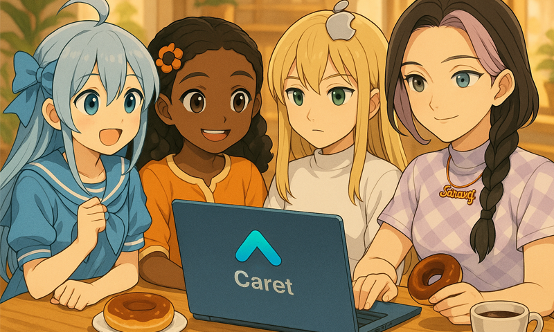

<div align="center">
<table>
    <tr>
      <td align="center">
        <a href="https://github.com/aicoding-caret/caret/blob/main/README.md">
            
        </a>
      </td>
      <td align="center">
        <a href="https://github.com/aicoding-caret/caret/blob/main/caret-docs/ko/README.md">
          
        </a>
      </td>
      <td align="center">
        <a href="https://github.com/aicoding-caret/caret/blob/main/caret-docs/ja/README.md">
          
        </a>
      </td>
      <td align="center">
        <a href="https://github.com/aicoding-caret/caret/blob/main/caret-docs/zh-cn/README.md">
          
        </a>
      </td>
    </tr>
  </table>
  <h1>🎯 Caret: 나만의 AI 코딩 파트너</h1>
  <p><strong>클라인(Cline)의 모든 기능 + 개성 있는 AI 동료 + 개선된 시스템 프롬프트</strong></p>
  
  <!-- 강력한 CTA 버튼 -->
  <p>
    <a href="https://marketplace.visualstudio.com/items?itemName=caretive.caret" style="background: #007ACC; color: white; padding: 12px 24px; text-decoration: none; border-radius: 6px; font-weight: bold; display: inline-block; margin: 8px;">
      📥 VS Code에서 지금 설치하기
    </a>
    <a href="https://docs.caret.team/ko/getting-started/what-is-caret" style="background: #28a745; color: white; padding: 12px 24px; text-decoration: none; border-radius: 6px; font-weight: bold; display: inline-block; margin: 8px;">
      📖 사용설명서
    </a>
  </p>
  
  <!-- 배지들 -->
  <p>
    <a href="https://marketplace.visualstudio.com/items?itemName=caretive.caret">
      
    </a>
    <a href="https://github.com/aicoding-caret/caret">
      
    </a>
  </p>

  <!-- 페르소나 이미지를 상단으로 이동 -->
  
  <p><em>나만의 AI 코딩 파트너를 선택하고 커스터마이즈하세요!</em></p>
</div>

---

## 🚀 최신 업데이트: Cline v3.32.7 완전 통합!

**Caret v0.3.0**은 이제 **Cline v3.32.7의 모든 기능**을 포함하며 Caret 고유 확장 기능과 100% 호환됩니다!

### 이번 머징의 주요 내용:
- ✅ **Cline v3.32.7 완전 채택** - 최신 Cline 기능 및 개선사항 모두 포함
- ✅ **10개 Caret 기능 재구현** - 최소 침습으로 모든 기능 보존 ([자세히 보기](../features/index.md))
- ✅ **최소 침습 전략** - Cline 파일 9개만 수정 (291줄)로 완벽한 호환성
- ✅ **AI 프롬프트 최적화** - 최적화된 편집 워크플로우로 API 요청 30-50% 감소
- ✅ **Focus Chain** - 복잡한 워크플로우를 위한 자동 작업 관리
- ✅ **300개 고유 AI 모델** - Claude Sonnet 4.5, GPT-5 등 25개 제공자 지원

### 마이그레이션 하이라이트:
- **Phase 4**: Backend 재구현 (100% 완료 ✅)
- **Phase 5**: Frontend 재구현 (100% 완료 ✅)
- **Phase 6**: 최종 검증 진행 중 🔄

**전체 머징 문서**: [merge-execution-master-plan.md](../merging/merge-execution-master-plan.md) 참조

---

## 🌟 Caret을 선택해야 하는 6가지 이유

1. **🔄 원클릭 모드 전환** - Cline 완벽 호환, 언제든 전환 가능
2. **🎭 개성 있는 AI 동료** - 나만의 페르소나로 재미있게 코딩
3. **🧠 개선된 시스템 프롬프트** - 더 똑똑하고 효율적인 AI 응답
4. **🌍 4개국어 완벽 지원** - 한국어, 영어, 일본어, 중국어 + 4개국어 매뉴얼
5. **⌨️ 향상된 UX** - 프롬프트 히스토리, 자동 모델 조회 등
6. **🎯 25개 제공자, 300개 모델** - Cline v3.32.7 완전 호환 + 확장

👉 **모든 독점 기능 보기**: [Caret 독점 기능 개요](https://docs.caret.team/ko/caret-exclusive/overview)  

## 🎭 1순위 특징: 나만의 AI 코딩 파트너 만들기

다른 AI 도구들과 완전히 차별화되는 **페르소나 시스템**! 단순한 텍스트 채팅을 넘어 시각적으로 생동감 넘치는 AI 동료와 함께 코딩하세요.

### 기본 제공 페르소나들:

<div align="center">
<table>
<tr>
<td align="center" width="120">
  <br/>
  <strong>캐럿</strong><br/>
  <small>친근한 로봇 친구</small>
</td>
<td align="center" width="120">
  <br/>
  <strong>오사랑</strong><br/>
  <small>K-POP 아이돌 개발자</small>
</td>
<td align="center" width="120">
  <br/>
  <strong>마도베 이치카</strong><br/>
  <small>Windows 11 OS-tan</small>
</td>
<td align="center" width="120">
  <br/>
  <strong>사이안 매킨</strong><br/>
  <small>macOS 도우미</small>
</td>
<td align="center" width="120">
  <br/>
  <strong>탄도 우분투</strong><br/>
  <small>오픈소스 협력자</small>
</td>
</tr>
</table>
</div>

**🎨 커스터마이징**: 나만의 AI 이름과 프로필 이미지 등록 가능!
**⚡ 언제든 전환 가능**: 페르소나 즉시 활성화/비활성화 - 순수 Cline 모드 사용 가능

## 🔄 Cline/Caret 토글 - 두 가지 모드를 자유자재로!

### 🎛️ **원클릭 모드 전환**
<div align="center">
  
  <strong> ⇄ </strong>
  
</div>

**🔵 Cline 모드** - 기존 Cline 그대로:
- ✅ **Plan/Act 방식** - 기존 Cline 사용자 친숙한 방식
- ✅ **모든 설정 호환** - 기존 설정 그대로 사용
- ✅ **워크플로우 동일** - 익숙한 사용법 그대로
- ✅ **안정성 보장** - Cline의 검증된 코어 엔진

**🟢 Caret 모드** - 확장된 기능들:
- 🎭 **페르소나 시스템** - 나만의 AI 동료 만들기
- 🧠 **개선된 시스템 프롬프트** - 더 똑똑하고 효율적인 AI
- 🌍 **4개국어 지원** - 완벽한 다국어 환경
- 🎯 **Chatbot/Agent** - 더 직관적인 대화 방식

### 💡 **언제든 전환 가능**
- **기존 Cline 사용자**: Cline 모드로 시작 → 필요시 Caret 모드 체험
- **새로운 사용자**: Caret 모드로 시작 → 원할 때 클래식 Cline 모드
- **프로젝트별 설정**: 프로젝트마다 다른 모드 사용 가능

## 🌍 언어의 장벽 없는 코딩

**4개국어 완벽 지원**으로 전 세계 개발자들이 모국어로 편리하게 사용할 수 있습니다:

### 🎌 지원 언어 (UI + 문서 + 메뉴얼)
- 🇰🇷 **한국어** - 완전한 한글화 (UI, AI 대화, 문서, 매뉴얼)
- 🇺🇸 **영어** - 네이티브 지원 (UI, AI 대화, 문서, 매뉴얼) 
- 🇯🇵 **일본어** - 완전한 일본어화 (UI, AI 대화, 문서, 매뉴얼)
- 🇨🇳 **중국어** - 완전한 중국어화 (UI, AI 대화, 문서, 매뉴얼)

### 📖 다국어 메뉴얼 시스템
- **docs.cline.bot 다국어화 진행 중** - Caret 전용 4개국어 메뉴얼 사이트
- **모든 기능 설명서** - 설치부터 고급 기능까지 모국어로 학습
- **실시간 언어 전환** - 언어별 즉시 전환 가능
- **커뮤니티 번역** - 각국 커뮤니티가 함께 만드는 정확한 번역

## 🚀 5분 만에 시작하기

### 1단계: 설치
```
VS Code 확장 탭에서 "Caret" 검색 → 설치
```

### 2단계: API 키 설정  
```
설정에서 사용할 AI 제공자의 API 키 입력
(OpenAI, Claude, Gemini 등 25개 제공자에서 300개 모델 지원)
```

### 3단계: 페르소나 선택
```
사이드바에서 마음에 드는 AI 페르소나 선택
또는 나만의 커스텀 페르소나 만들기
```

### 4단계: 코딩 시작!
```
Ctrl+' 단축키로 채팅창 열고
"안녕! 리액트 컴포넌트 만들어줘" 입력
```

## 🚀 Caret의 11가지 핵심 특징

Caret은 Cline과 100% 호환성을 유지하면서 강력한 새 기능들을 확장합니다:

<div align="center">

| 특징 | 설명 | 문서 |
|------|------|------|
| **F01** | **공통 유틸리티** | 공유 유틸리티 함수 및 헬퍼 | [📖 상세보기](../features/f01-common-util.md) |
| **F02** | **다국어 i18n** | 4개국어 지원 (한/영/일/중) | [📖 상세보기](../features/f02-multilingual-i18n.md) |
| **F03** | **브랜딩 & UI 시스템** | 동적 브랜드 전환 (Caret/CodeCenter) | [📖 상세보기](../features/f03-branding-ui.md) |
| **F04** | **Caret 계정 시스템** | 사용자 인증 및 관리 | [📖 상세보기](../features/f04-caret-account.md) |
| **F05** | **다중 룰 우선순위 설정** | 다층 룰 구성 시스템 | [📖 상세보기](../features/f05-rule-priority-system.md) |
| **F06** | **Caret 프롬프트 시스템** | JSON 동적 프롬프트 & 모드 전환 | [📖 상세보기](../features/f06-caret-prompt-system.md) |
| **F07** | **페르소나 시스템** | 커스터마이즈 가능한 AI 동료 | [📖 상세보기](../features/f07-persona-system.md) |
| **F08** | **Feature Config 시스템** | 모듈식 기능 관리 | [📖 상세보기](../features/f08-feature-config-system.md) |
| **F09** | **Enhanced Provider Setup** | 고급 AI 프로바이더 구성 | [📖 상세보기](../features/f09-enhanced-provider-setup.md) |
| **F10** | **입력 히스토리 시스템** | 터미널 스타일 명령 히스토리 | [📖 상세보기](../features/f10-input-history-system.md) |
| **F11** | **지식 동기화 시스템** | AI와 개발자가 동일한 지식을 공유하여 원활한 협업을 보장합니다 | [📖 상세보기](../features/f11-ai-developer-knowledge-parity.md) |

</div>

→ **[전체 특징 색인 보기](../features/index.md)**

## 💪 압도적인 성능과 경제성

<div align="center">

| 비교 항목 | 다른 AI 도구들 | **Caret** |
|-----------|---------------|-----------|
| **토큰 사용량** | 기본 | **최적화됨** |
| **API 비용** | 기본 | **절약됨** |
| **응답 속도** | 보통 | **최적화됨** |
| **다국어 지원** | ❌ | **✅ 4개국어 + 매뉴얼** |
| **페르소나** | ❌ | **✅ 지원** |
| **Cline 호환** | ❌ | **✅ 100%** |

</div>

시스템 프롬프트 최적화를 통해 더 효율적인 AI 응답을 제공합니다.

## 🎯 지원하는 AI 모델

### 🚀 **최신 Cline v3.32.7 아키텍처 완전 호환**

<div align="center">
  <h3>🎯 <strong>20개 제공자</strong> | 🤖 <strong>237개 고유 모델</strong> | 📊 <strong>Cline v3.32.7 완전 호환</strong></h3>

  **주요 제공자**: OpenAI GPT-5, Anthropic Claude Sonnet 4.5, Google Gemini 2.5, DeepSeek V3, Qwen3 등

  <a href="../../caret-docs/development/support-model-list.mdx">
    <strong>📋 실시간 업데이트되는 전체 모델 목록 보기 →</strong>
  </a>
</div>

### 💡 **Cline의 모든 기능 + Caret 확장**
- ✅ **Plan/Act 모드** - Cline의 검증된 투명한 개발 프로세스
- ✅ **MCP 지원** - Model Context Protocol로 외부 시스템 연결
- ✅ **제로 트러스트 보안** - 클라이언트 사이드 완전 실행
- ✅ **모델 자유 전환** - Claude, Gemini, Kimi 등 즉시 전환
- ➕ **페르소나 시스템** - Caret만의 개성 있는 AI 동료
- ➕ **개선된 시스템 프롬프트** - 더 똑똑하고 효율적인 AI 응답
- ➕ **4개국어 지원** - 완벽한 다국어 환경

## 🔮 로드맵: 더 강력해질 Caret

**곧 출시 예정** (1-2주 내):
- 🔐 **자체 로그인 시스템** - API 키 관리 간소화
- 💳 **크레딧 구매 시스템** - 더 편리한 과금 체계
- 🏠 **로컬 LLM 지원** - 인터넷 없이도 사용 가능
- 🇰🇷 **한국 특화 모델** - Hyperclova X, EXAONE 등

**장기 계획**:
- 👥 **팀 협업 기능** - 여러 명이 함께 AI와 작업
- 🎓 **학습 기능** - 내 코딩 스타일 학습하는 개인화
- 🔌 **플러그인 시스템** - 커뮤니티 확장 기능

## 🤝 함께 만들어가는 오픈소스

### 🎁 기여자 혜택
- 💰 **서비스 크레딧** - 기여 규모에 따른 무료 사용권
- 🌟 **기여자 등재** - GitHub과 공식 웹사이트에 이름 등재
- 🚀 **베타 테스터** - 새 기능 우선 체험

### 참여 방법
1. **버그 신고** → [Issues](https://github.com/aicoding-caret/caret/issues)에서 신고
2. **기능 제안** → 새로운 아이디어 공유
3. **코드 기여** → Fork 후 Pull Request
4. **문서 번역** → 다른 언어 번역 참여

## 📞 지원 및 커뮤니티

- 🏠 **공식 홈페이지**: https://caret.team
- 💬 **Discord 커뮤니티**: [참여하기](https://discord.gg/caret) 
- 📧 **이메일 문의**: support@caret.team
- 🐛 **버그 신고**: [GitHub Issues](https://github.com/aicoding-caret/caret/issues)

---

<div align="center">
  <h2>🎯 지금 바로 시작하세요!</h2>
  
  <a href="https://marketplace.visualstudio.com/items?itemName=caretive.caret" style="background: #007ACC; color: white; padding: 16px 32px; text-decoration: none; border-radius: 8px; font-weight: bold; font-size: 18px; display: inline-block; margin: 16px;">
    📥 VS Code에서 무료 설치
  </a>
  
  <p><small>⭐ 마음에 드시면 GitHub에서 Star 눌러주세요!</small></p>
</div>

---

## 🛠️ 개발자를 위한 상세 문서

개발에 참여하고 싶다면 아래 문서들을 확인하세요:

### 📚 핵심 가이드
- **[개발자 가이드](../../DEVELOPER_GUIDE.md)** - 빌드, 테스트 기본 정보
- **[Caret 아키텍처](../development/caret-architecture-and-implementation-guide.mdx)** - 전체 시스템 구조
- **[신입 개발자 가이드](../development/new-developer-guide.mdx)** - 프로젝트 입문

### 🔧 기술 문서
- **[AI 메시지 플로우](../development/ai-message-flow-guide.mdx)** - AI 시스템 이해
- **[테스트 가이드](../development/testing-guide.mdx)** - TDD 개발 방법
- **[다국어 시스템](../development/locale.mdx)** - i18n 구현

💡 **개발 시작 전 필독**: [AI 작업 방법론 가이드](../guides/ai-work-method-guide.mdx)를 먼저 읽어보세요.
