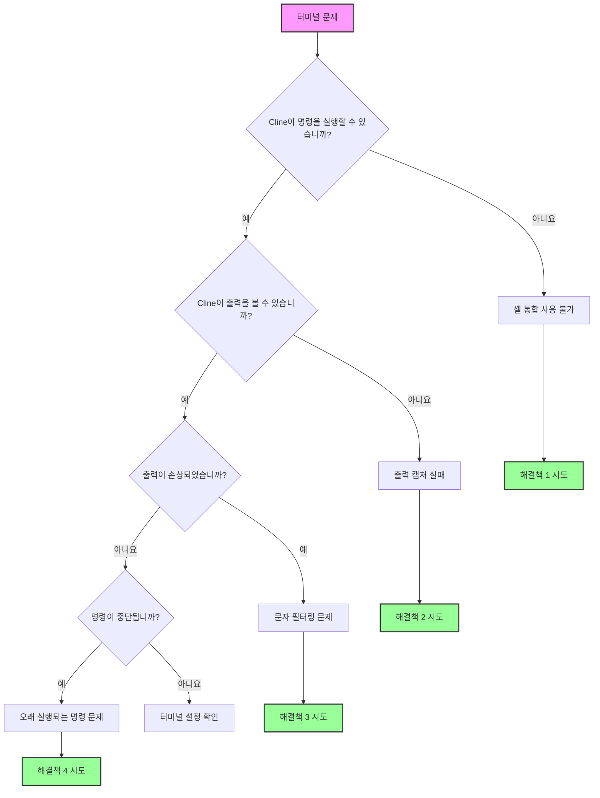

이 가이드는 Cline에서 터미널 통합 문제를 해결하는 데 도움이 됩니다. 터미널 통합은 Cline이 명령을 실행하고 출력을 읽어 오류, 테스트 결과 및 명령 응답을 이해할 수 있도록 하는 데 중요합니다.

<Tip>
	터미널 문제가 발생하는 경우 Cline 설정의 "터미널 설정"에서 `bash`와 같은 더 간단한 셸로 전환해 보세요.

    이렇게 하면 대부분의 터미널 통합 문제가 해결됩니다.

</Tip>

## 빠른 진단 순서도

이 순서도를 따라 문제를 빠르게 식별하세요.



## 일반적인 문제 및 빠른 해결책

### 1. 셸 통합 사용 불가

**증상:**

-   메시지: "셸 통합 사용 불가"
-   명령은 실행되지만 Cline이 출력을 읽을 수 없음
-   터미널은 수동으로 잘 작동하지만 Cline에서는 작동하지 않음

**빠른 해결책:**

#### macOS

-   **bash로 전환**

    1. Cline 설정으로 이동
    2. **"터미널 설정"** 탭을 왼쪽 클릭
    3. **"기본 터미널 프로필"**로 이동하여 드롭다운 메뉴에서 **"bash"** 선택

-   **Oh-My-Zsh 일시적으로 비활성화**:

    1. zsh를 사용하는 경우 터미널에 `mv ~/.zshrc ~/.zshrc.backup` 입력
    2. VSCode 다시 시작

-   **환경 설정**:
    1.a Zsh 사용자의 경우 다음 Zsh 명령 중 하나를 사용하여 셸 프로필 편집:

          - `nano ~/.zshrc`
          - `vim ~/.zshrc`
          - `code ~/.zshrc`

    1.b Bash 사용자의 경우

          - nano ~/.bash_profile

    2. 셸 구성에 다음 추가: `export TERM=xterm-256color`
    3. 구성 저장

#### Windows

-   **PowerShell 7 사용**

    1. Microsoft Store에서 설치
    2. Cline 설정으로 이동
    3. **"터미널 설정"** 탭을 왼쪽 클릭
    4. **"기본 터미널 프로필"**로 이동하여 드롭다운 메뉴에서 **"PowerShell 7"** 선택

-   **Windows ConPTY 비활성화**

    1. VSCode 설정으로 이동
    2. 설정 검색창에 "Integrated: Windows Enable Conpty" 입력
    3. 옵션 선택 취소

-   **명령 프롬프트 시도**
    1. Cline 설정으로 이동
    2. **"터미널 설정"** 탭을 왼쪽 클릭
    3. **"기본 터미널 프로필"**로 이동하여 드롭다운 메뉴에서 **"명령 프롬프트"** 선택

#### Linux

-   **bash 사용**

    1. Cline 설정으로 이동
    2. **"터미널 설정"** 탭을 왼쪽 클릭
    3. **"기본 터미널 프로필"**로 이동하여 드롭다운 메뉴에서 **"bash"** 선택

-   **권한 확인**

    1. VSCode에 터미널 액세스 권한이 있는지 확인

-   **사용자 지정 프롬프트 비활성화**
    1. `.bashrc`에서 프롬프트 사용자 지정 주석 처리

### 2. 명령 출력 비표시

**증상:**

-   Cline 채팅에 "[명령이 실행 중이지만 출력이 없습니다]" 메시지 표시
-   명령은 완료되지만 Cline이 결과를 볼 수 없음
-   명령이 때로는 작동하지만 일관되지 않음

**해결책:**

-   **셸 통합 시간 초과 증가**

    1. Cline에서 채팅 창 오른쪽 상단 모서리에 있는 **설정** 버튼을 왼쪽 클릭
    2. **설정** 창에서 왼쪽 열의 **"터미널 설정"** 탭을 왼쪽 클릭
    3. "셸 통합 시간 초과(초)"로 이동하여 텍스트 필드에 **"10"** 입력

-   **터미널 재사용 비활성화**

    1. Cline에서 채팅 창 오른쪽 상단 모서리에 있는 **설정** 버튼을 왼쪽 클릭
    2. **설정** 창에서 왼쪽 열의 **"터미널 설정"** 탭을 왼쪽 클릭
    3. **"공격적인 터미널 재사용 활성화"**를 찾아 **선택 취소**

-   **간섭하는 확장 프로그램 확인**
    1. 다른 터미널 관련 VSCode 확장 프로그램 비활성화

### 3. 문자 필터링 문제

**증상:**

-   출력에서 쉼표 누락(JSON이 손상된 것으로 보임)
-   터미널 출력에서 특수 문자 제거
-   수동으로 실행할 때는 나타나지 않는 구문 오류

**해결책:**
이는 출력 처리의 알려진 버그입니다. 해결 방법:

-   AI에게 대신 파일 출력을 사용하도록 권장
    1. Cline 채팅 또는 Cline 규칙에서 파일을 읽기 전에 `command > output.txt`를 사용하도록 지시

<Tip>
	이러한 종류의 문제는 최신 Cline 버전에서 부분적으로만 해결되었으므로, 여전히 문제가 발생하는 경우 GitHub 이슈를 생성하세요.
	지속적인 문제인 경우.
</Tip>

### 4. 오래 실행되는 명령 및 진행률 표시줄

**증상:**

-   Docker 빌드가 Cline에서 완료되지 않음
-   진행률 표시줄이 수천 개의 토큰을 소비
-   Cline 버튼 "실행 중 계속"이 채팅에서 제대로 작동하지 않음

<Tip>
	이러한 종류의 문제는 최신 Cline 버전에서 해결되었지만, 여전히 문제가 발생하는 경우 GitHub 이슈를 생성하세요.
	이 문제에 대해.
</Tip>

## 터미널 설정 설명

Cline에서 설정 아이콘을 클릭하고 "터미널 설정" 섹션으로 이동하여 액세스하세요.

### 기본 터미널 프로필

-   **기능**: Cline이 명령에 사용하는 셸 선택
-   **변경 시기**: 기본 셸에서 셸 통합 문제가 발생하는 경우
-   **권장**: - macOS: bash (zsh에 문제가 있는 경우) - Windows: PowerShell 7 - Linux: bash

### 셸 통합 시간 초과

-   **기능**: Cline이 터미널이 준비될 때까지 기다리는 시간
-   **기본값**: 4초
-   **증가 시기**:
    -   느린 셸 시작(무거운 .zshrc/.bashrc)
    -   WSL 환경
    -   SSH 연결
-   **권장**: - 문제가 있는 경우 10초부터 시작

### 공격적인 터미널 재사용 활성화

-   **기능**: 올바른 디렉토리에 있지 않더라도 기존 터미널 재사용
-   **비활성화 시기**:
    -   잘못된 디렉토리에서 명령 실행
    -   가상 환경 문제
    -   터미널 상태 손상
-   **절충점**: - 비활성화하면 더 많은 터미널이 생성되지만 깨끗한 상태 보장

### 터미널 출력 줄 제한

-   **기능**: Cline이 터미널 출력에서 읽는 줄 수 제한
-   **기본값**: 500줄
-   **조정 시기**:
    -   자세한 빌드 출력의 경우 증가
    -   토큰 제한에 도달하는 경우 감소
    -   진행률 표시줄이 있는 명령의 경우 100으로 설정

## 플랫폼별 해결책

### macOS 문제

#### Oh-My-Zsh 충돌

Oh-My-Zsh는 종종 셸 통합을 방해합니다. 해결책:

1. VSCode용 최소 `.zshrc` 생성:
    ```bash
    # ~/.zshrc-vscode
    export TERM=xterm-256color
    export PAGER=cat
    # 최소 PATH 및 환경 설정
    ```
2. VSCode가 이를 사용하도록 구성:
    ```json
    {
    	"terminal.integrated.env.osx": {
    		"ZDOTDIR": "~/.zshrc-vscode"
    	}
    }
    ```

#### macOS 15+ 문제

최신 macOS 버전은 더 엄격한 터미널 권한을 가집니다.

1. 시스템 환경설정 → 개인 정보 보호 및 보안 → 개발자 도구
2. Visual Studio Code 추가
3. VSCode 완전히 다시 시작

### Windows 문제

Windows를 사용하고 이전 단계를 시도한 후에도 셸 통합 문제가 계속 발생하는 경우 Git Bash(또는 PowerShell)를 사용하는 것이 좋습니다.

### Git Bash

Git Bash는 Windows에서 Unix와 유사한 명령줄 환경을 제공하는 터미널 에뮬레이터입니다. Git Bash를 사용하려면 다음을 수행해야 합니다.

1. [https://git-scm.com/downloads/win](https://git-scm.com/downloads/win)에서 Git for Windows 설치 프로그램 다운로드 및 실행
2. VSCode 종료 및 다시 열기
3. `Ctrl + Shift + P`를 눌러 명령 팔레트 열기
4. "Terminal: Select Default Profile" 입력 및 선택
5. "Git Bash" 선택

### PowerShell

여전히 PowerShell을 사용하고 싶다면 업데이트된 버전(최소 v7 이상)을 사용하고 있는지 확인하세요.
  - 현재 PowerShell 버전을 확인하려면 다음을 실행하세요: `$PSVersionTable.PSVersion`
  - 버전이 7 미만인 경우 [PowerShell 업데이트](https://learn.microsoft.com/en-us/powershell/scripting/whats-new/migrating-from-windows-powershell-51-to-powershell-7?view=powershell-7.4#installing-powershell-7).

PowerShell 실행 정책을 조정해야 할 수도 있습니다. 기본적으로 PowerShell은 보안상의 이유로 스크립트 실행을 제한합니다.

#### PowerShell 실행 정책 이해

PowerShell은 시스템에서 실행할 수 있는 스크립트를 결정하기 위해 실행 정책을 사용합니다. 가장 일반적인 정책은 다음과 같습니다.

- `Restricted`: PowerShell 스크립트를 실행할 수 없습니다. 이것이 기본 설정입니다.
- `AllSigned`: 로컬 스크립트를 포함한 모든 스크립트는 신뢰할 수 있는 게시자가 서명해야 합니다.
- `RemoteSigned`: 로컬에서 생성된 스크립트는 실행할 수 있지만 인터넷에서 다운로드한 스크립트는 서명해야 합니다.
- `Unrestricted`: 제한 없음. 인터넷에서 다운로드한 스크립트를 실행하기 전에 경고가 표시되지만 모든 스크립트를 실행할 수 있습니다.

VSCode에서 개발 작업을 수행하는 경우 `RemoteSigned` 정책이 일반적으로 권장됩니다. 이 정책은 다운로드한 스크립트에 대한 보안을 유지하면서 로컬에서 생성된 스크립트를 제한 없이 실행할 수 있도록 합니다. PowerShell 실행 정책에 대해 자세히 알아보고 변경의 보안 영향을 이해하려면 Microsoft 문서: [실행 정책 정보](https://learn.microsoft.com/en-us/powershell/module/microsoft.powershell.core/about/about_execution_policies)를 방문하세요.

#### 실행 정책 변경 단계

1. 관리자 권한으로 PowerShell 열기: `Win + X`를 누르고 "Windows PowerShell (관리자)" 또는 "Windows 터미널 (관리자)"를 선택합니다.

2. 다음 명령을 실행하여 현재 실행 정책 확인:
     ```powershell
     Get-ExecutionPolicy
     ```
   - 출력이 이미 `RemoteSigned`, `Unrestricted` 또는 `Bypass`인 경우 실행 정책을 변경할 필요가 없을 수 있습니다. 이러한 정책은 셸 통합이 작동하도록 허용해야 합니다.
   - 출력이 `Restricted` 또는 `AllSigned`인 경우 셸 통합을 활성화하려면 정책을 변경해야 할 수 있습니다.

3. 다음 명령을 실행하여 실행 정책 변경:
     ```powershell
     Set-ExecutionPolicy RemoteSigned -Scope CurrentUser
     ```
   - 이렇게 하면 정책이 현재 사용자에게만 `RemoteSigned`로 설정되며, 이는 시스템 전체를 변경하는 것보다 안전합니다.

4. 메시지가 표시되면 `Y`를 입력하고 Enter 키를 눌러 변경 사항을 확인합니다.

5. `Get-ExecutionPolicy`를 다시 실행하여 정책 변경 사항을 확인합니다.

6. VSCode를 다시 시작하고 셸 통합을 다시 시도합니다.

#### WSL 통합

WSL 문제의 경우:

1. VSCode용 WSL 확장 프로그램 설치
2. WSL에서 폴더 열기: WSL 터미널에서 `code .`
3. Cline에서 터미널 프로필로 "WSL Bash" 선택

#### 경로 문제

Windows 경로 문제:

1. Cline에서 슬래시 사용: `C:/Users/...`
2. 공백이 있는 경로 인용: `"C:/Program Files/..."`
3. `~` 사용 피하기 - 전체 경로 사용

### Linux/SSH/컨테이너 문제

#### SSH 연결

원격 개발의 경우:

1. 로컬이 아닌 원격 머신에 Cline 설치
2. SSH 확장 프로그램의 통합 터미널 사용
3. 시간 초과를 15초 이상으로 늘립니다.

#### Docker 컨테이너

컨테이너에서 개발할 때:

1. 컨테이너에 Cline 설치
2. 개발 컨테이너 확장 프로그램 사용
3. 셸 통합 스크립트가 사용 가능한지 확인

## 셸별 수정 사항

### Zsh

```bash
# ~/.zshrc에 추가
export TERM=xterm-256color
export PAGER=cat
# VSCode용 멋진 프롬프트 비활성화
if [[ "$TERM_PROGRAM" == "vscode" ]]; then
    PS1="%n@%m %1~ %# "
fi
```

### Bash

```bash
# ~/.bashrc에 추가
export TERM=xterm-256color
export PAGER=cat
# VSCode용 간단한 프롬프트
if [[ "$TERM_PROGRAM" == "vscode" ]]; then
    PS1='\u@\h:\w\$ '
fi
```

### Fish

```fish
# ~/.config/fish/config.fish에 추가
set -x TERM xterm-256color
set -x PAGER cat
# VSCode에서 멋진 기능 비활성화
if test "$TERM_PROGRAM" = "vscode"
    function fish_prompt
        echo (whoami)'@'(hostname)':'(pwd)'> '
    end
end
```

### PowerShell

```powershell
# $PROFILE에 추가
$env:PAGER = "cat"
# 진행률 표시줄 비활성화
$ProgressPreference = 'SilentlyContinue'
```

## 고급 문제 해결

### 디버그 모드

터미널 디버깅을 활성화하여 무슨 일이 일어나고 있는지 확인하세요.

1. VSCode 명령 팔레트 열기(Cmd/Ctrl+Shift+P)
2. 실행: "Developer: Set Log Level..."
3. "Trace" 선택
4. 출력 패널 → "Cline"에서 터미널 로그 확인

### 수동 셸 통합 테스트

셸 통합이 전혀 작동하는지 테스트:

```bash
# VSCode 터미널에서
echo $TERM_PROGRAM  # "vscode"가 표시되어야 함
echo $VSCODE_SHELL_INTEGRATION  # "1"이 표시되어야 함
```

## FAQ

### Cline이 왜 그렇게 많은 터미널을 생성합니까?

셸 통합이 실패하면 Cline은 터미널을 안전하게 재사용할 수 없습니다(오래 실행되는 프로세스가 있을 수 있음). 셸 통합을 활성화하거나 터미널 재사용 설정을 조정하세요.

### 사용자 지정 셸(nushell, xonsh 등)을 사용할 수 있습니까?

Cline은 bash, zsh, fish 및 PowerShell을 공식적으로 지원합니다. 사용자 지정 셸은 작동할 수 있지만 보장되지는 않습니다. bash를 대체 셸로 사용하세요.

### 일부 명령은 작동하지만 다른 명령은 작동하지 않는 이유는 무엇입니까?

대화형 기능(페이저, 진행률 표시줄, curses)을 사용하는 명령은 종종 실패합니다. `PAGER=cat`을 설정하고 비대화형 플래그를 사용하세요.

### 셸 통합이 작동하는지 어떻게 알 수 있습니까?

작동하는 통합은 Cline 채팅에 명령 출력을 표시합니다. 실패한 통합은 "셸 통합 사용 불가" 또는 "[명령이 실행 중이지만 출력이 없습니다]"를 표시합니다.

## 여전히 문제가 있습니까?

모든 것을 시도했다면:

1. **디버그 정보 수집**:

    ```bash
    echo "Shell: $SHELL"
    echo "Term: $TERM"
    echo "VSCode: $TERM_PROGRAM"
    which bash
    bash --version
    ```

2. **문제 보고**:
    - Cline GitHub 이슈에서 `/reportbug` 사용
    - 디버그 정보 포함
    - 시도한 해결책 언급

:::tip
	기억하세요: 대부분의 터미널 문제는 bash로 전환하고 시간 초과를 늘리면 해결됩니다. 복잡한 해결책을 시도하기 전에 거기서부터 시작하세요.
:::
